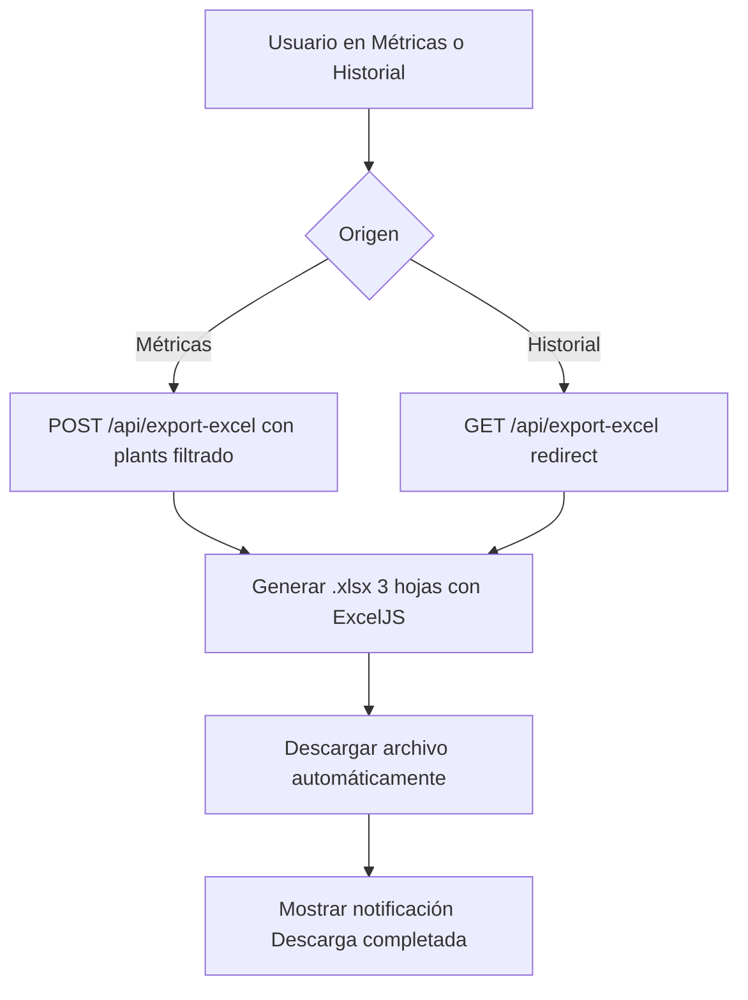
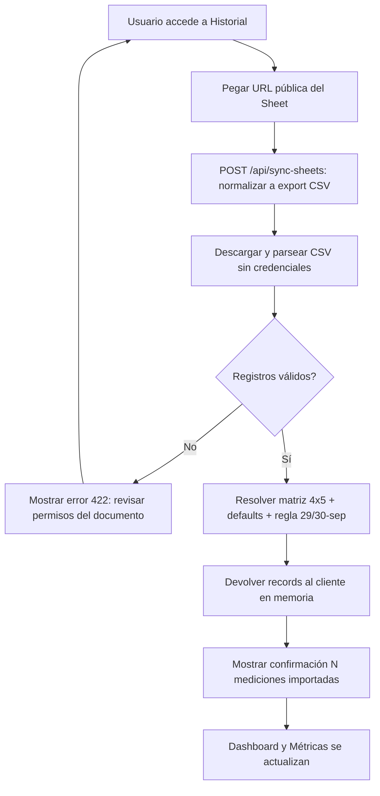

# Diagramas de Actividad

## AD-001: Flujo de Login del Usuario

```mermaid
flowchart TD
    A[Usuario navega a login] --> B[Ingresar email y contraseña]
    B --> C{Credenciales válidas?}
    C -- No --> D[Mostrar error "Credenciales inválidas"]
    D --> B
    C -- Sí --> E[Generar token de sesión]
    E --> F[Guardar sesión en cookies]
    F --> G[Redirigir al dashboard]
    G --> H[Mostrar bienvenida usuario]
```

## AD-002: Flujo de Configuración de Umbrales de Alerta ⚠️ PROPUESTO (no implementado)

> Estado real (oct-2026): Settings no tiene UI de umbrales. Diagrama objetivo futuro.

```mermaid
flowchart TD
    A[Usuario accede a configuración] --> B[Ingresar umbrales temperatura]
    B --> C[Ingresar umbrales humedad]
    C --> D[Ingresar umbrales luz]
    D --> E[Validar que min < max]
    E -- No --> F[Mostrar error: "Mínimo debe ser menor que máximo"]
    F --> B
    E -- Sí --> G[Guardar configuración en BD]
    G --> H[Mostrar confirmación "Configuración guardada"]
    H --> I[Sistema comienza monitoreo]
    I --> J[Generar alerta si se supera umbral]
    J --> K[Mostrar notificación push/toast]
```

## AD-003: Flujo de Exportación de Datos



> Solo `.xlsx` (CSV no implementado). Hojas: Mediciones de Hoy, Historial Completo, Rangos Agronómicos.

## AD-004: Flujo de Importación desde Google Sheets



> Dirección Sheets → app (no se escribe en Sheets) y sin persistencia en PG (ver DATABASE §5).