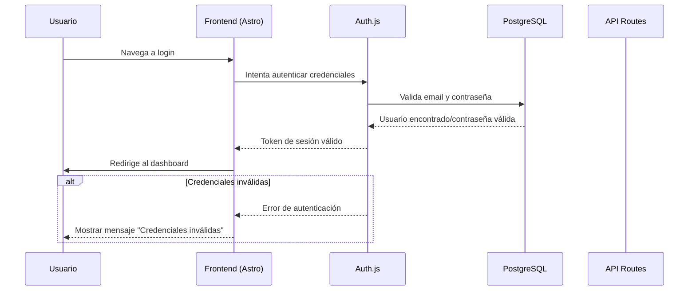
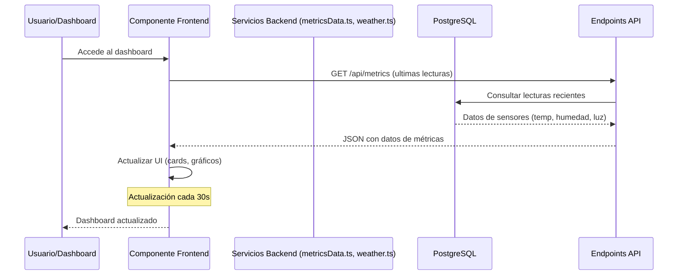
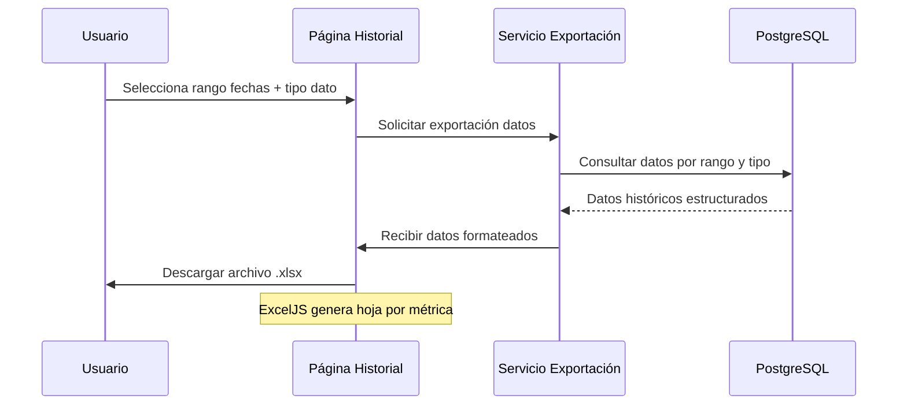
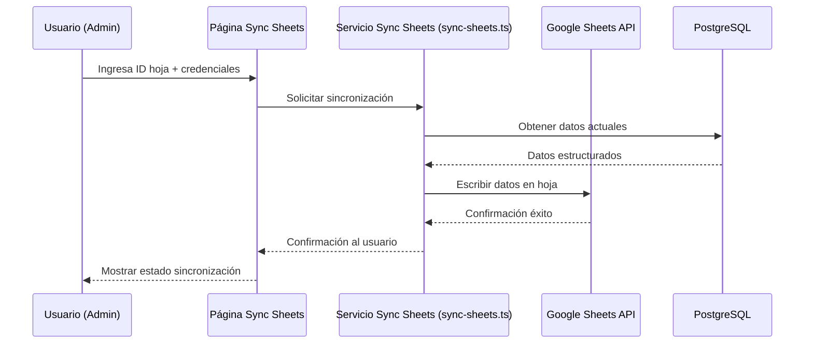

# Diagramas de Secuencia

## SD-001: Flujo de Autenticación

## SD-002: Flujo de Obtención de Datos en Tiempo Real

## SD-003: Flujo de Exportación a Excel

## SD-004: Flujo de Sincronización Google Sheets

