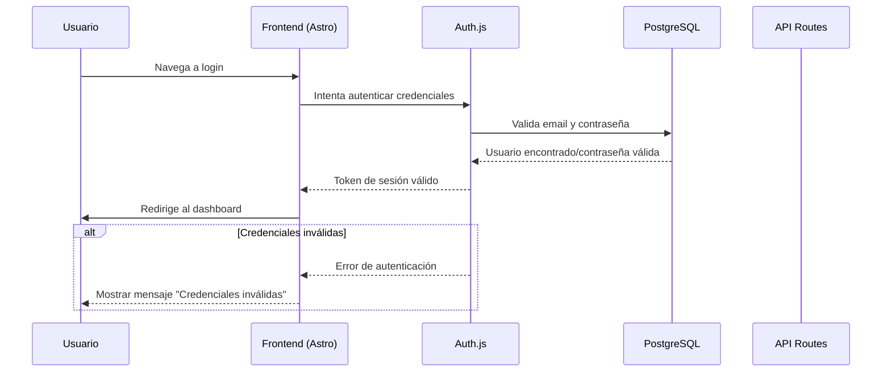
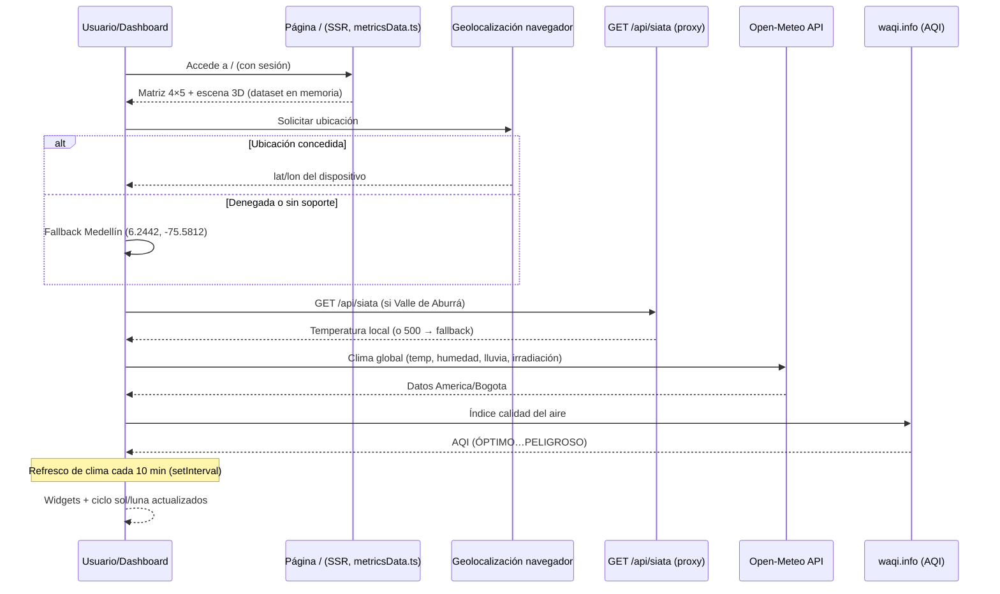
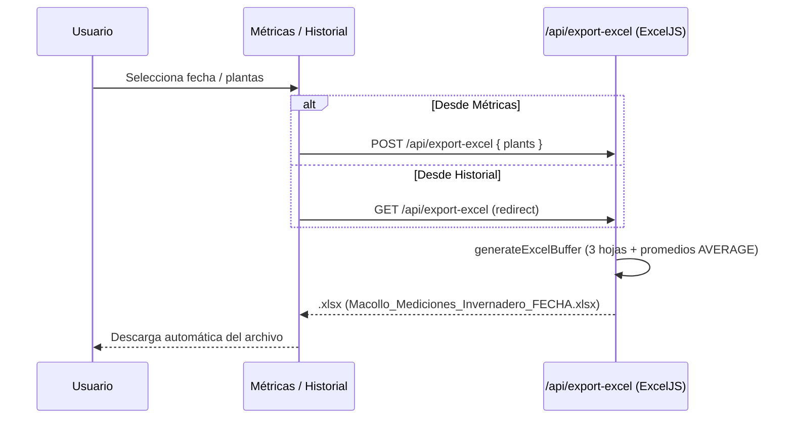
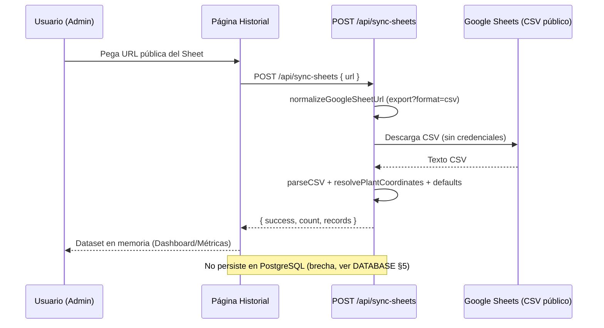

# Diagramas de Secuencia

## SD-001: Flujo de Autenticación

```mermaid
sequenceDiagram
    participant User as Usuario
    participant Front as Frontend (Astro)
    participant Auth as Auth.js
    participant DB as PostgreSQL
    participant API as API Routes

    %% Login flow
    User->>Front: Navega a login
    Front->>Auth: Intenta autenticar credenciales
    Auth->>DB: Valida email y contraseña
    DB-->>Auth: Usuario encontrado/contraseña válida
    Auth-->>Front: Token de sesión válido
    Front->>User: Redirige al dashboard
    
    %% Failed login
    alt Credenciales inválidas
        Auth-->>Front: Error de autenticación
        Front-->>User: Mostrar mensaje "Credenciales inválidas"
    end
```

## SD-002: Flujo de Monitoreo (Dashboard + Clima)

```mermaid
sequenceDiagram
    participant User as Usuario/Dashboard
    participant Page as Página / (SSR, metricsData.ts)
    participant Geo as Geolocalización navegador
    participant Proxy as GET /api/siata (proxy)
    participant OM as Open-Meteo API
    participant AQI as waqi.info (AQI)

    User->>Page: Accede a / (con sesión)
    Page-->>User: Matriz 4×5 + escena 3D (dataset en memoria)
    User->>Geo: Solicitar ubicación
    alt Ubicación concedida
        Geo-->>User: lat/lon del dispositivo
    else Denegada o sin soporte
        User->>User: Fallback Medellín (6.2442, -75.5812)
    end
    User->>Proxy: GET /api/siata (si Valle de Aburrá)
    Proxy-->>User: Temperatura local (o 500 → fallback)
    User->>OM: Clima global (temp, humedad, lluvia, irradiación)
    OM-->>User: Datos America/Bogota
    User->>AQI: Índice calidad del aire
    AQI-->>User: AQI (ÓPTIMO…PELIGROSO)
    Note over User: Refresco de clima cada 10 min (setInterval)
    User-->>User: Widgets + ciclo sol/luna actualizados
```

## SD-003: Flujo de Exportación a Excel

```mermaid
sequenceDiagram
    participant User as Usuario
    participant Page as Métricas / Historial
    participant API as /api/export-excel (ExcelJS)

    User->>Page: Selecciona fecha / plantas
    alt Desde Métricas
        Page->>API: POST /api/export-excel { plants }
    else Desde Historial
        Page->>API: GET /api/export-excel (redirect)
    end
    API->>API: generateExcelBuffer (3 hojas + promedios AVERAGE)
    API-->>Page: .xlsx (Macollo_Mediciones_Invernadero_FECHA.xlsx)
    Page-->>User: Descarga automática del archivo
```

## SD-004: Flujo de Importación desde Google Sheets

```mermaid
sequenceDiagram
    participant User as Usuario (Admin)
    participant Page as Página Historial
    participant API as POST /api/sync-sheets
    participant Google as Google Sheets (CSV público)

    User->>Page: Pega URL pública del Sheet
    Page->>API: POST /api/sync-sheets { url }
    API->>API: normalizeGoogleSheetUrl (export?format=csv)
    API->>Google: Descarga CSV (sin credenciales)
    Google-->>API: Texto CSV
    API->>API: parseCSV + resolvePlantCoordinates + defaults
    API-->>Page: { success, count, records }
    Page-->>User: Dataset en memoria (Dashboard/Métricas)
    Note over Page,API: No persiste en PostgreSQL (brecha, ver DATABASE §5)
```