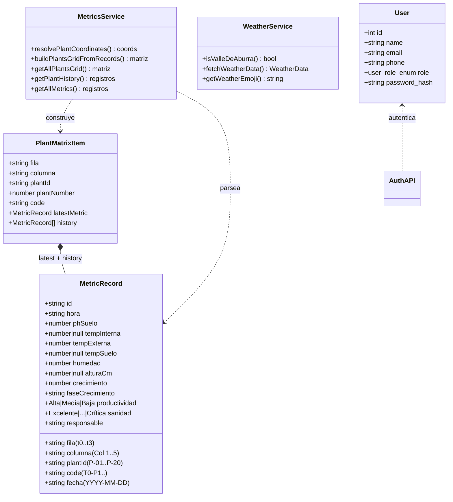
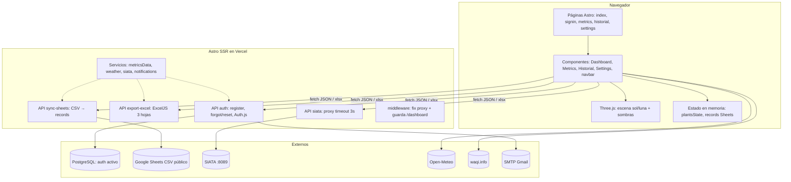
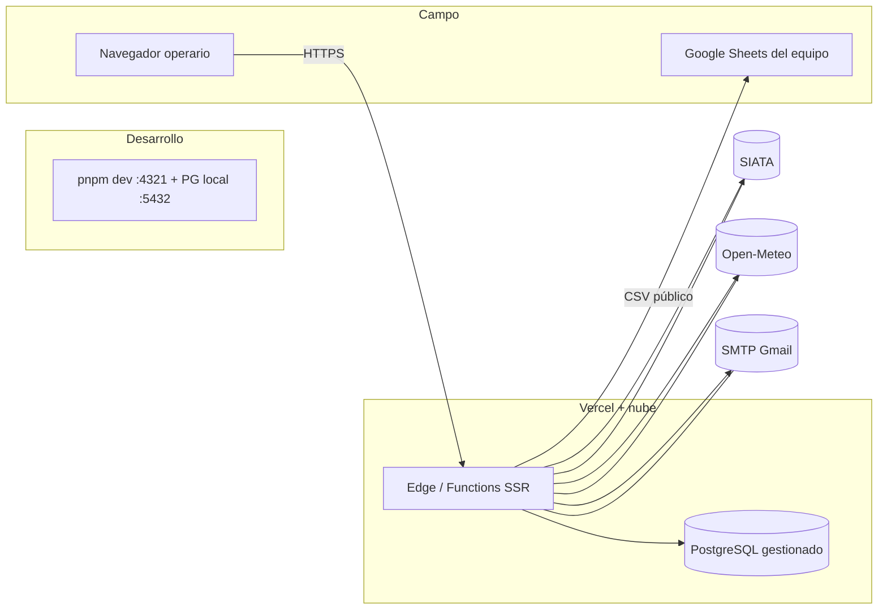
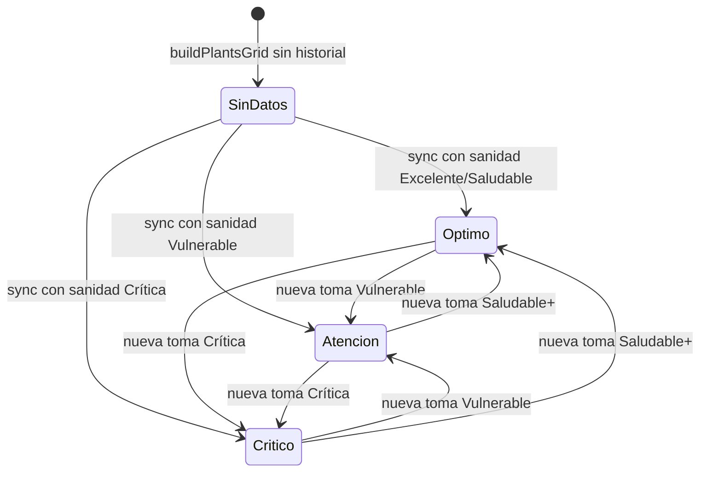

# Diagramas UML — Proyecto Invernadero (Macollo)

> Mermaid, derivado del código (oct-2026). ER detallado en [DATABASE](./DATABASE.md) §4; secuencias/actividades en sus docs.

## 1. Diagrama de clases (dominio agronómico + auth)

## 2. Diagrama de componentes

## 3. Diagrama de despliegue

## 4. Diagrama de estados (planta)

